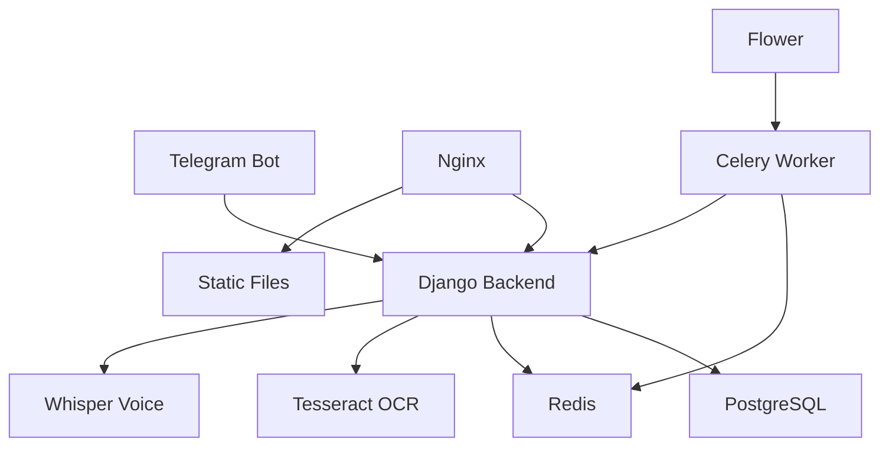

# 🚀 OvozPay - Автоматизированная система учета расходов с ИИ

[](https://www.djangoproject.com/)
[](https://www.docker.com/)
[](https://core.telegram.org/bots)
[](https://github.com/tesseract-ocr/tesseract)

OvozPay - это современная система учета личных финансов с поддержкой искусственного интеллекта. Система автоматически распознает чеки с помощью OCR, обрабатывает голосовые команды и ведет учет расходов через удобный Telegram бот.

## ✨ Основные возможности

### 🤖 Искусственный интеллект
- **OCR распознавание чеков** с помощью Tesseract (русский, английский, узбекский)
- **Голосовое распознавание** с помощью OpenAI Whisper
- **Автоматическое сопоставление** голосовых команд и чеков
- **Мультиязычная поддержка** (RU/EN/UZ)

### 💬 Telegram бот
- Простой и интуитивный интерфейс
- Загрузка фотографий чеков
- Голосовые команды
- Автоматическое создание транзакций
- Уведомления и статистика

### 🏗️ Архитектура
- **Django** backend с REST API
- **PostgreSQL** база данных
- **Redis** для очередей Celery
- **Nginx** reverse proxy с SSL
- **Docker** контейнеризация
- **Микросервисная архитектура** для AI компонентов

## 🐳 Docker деплой - Быстрый старт

### Требования
- Docker 24.0+
- Docker Compose 2.0+
- 4GB RAM (рекомендуется 8GB)

### Автоматическое развертывание

```bash
# 1. Клонирование репозитория
git clone https://github.com/your-username/ovozpay.git
cd ovozpay

# 2. Настройка окружения
cp env.example .env
# Отредактируйте .env файл (TELEGRAM_BOT_TOKEN обязателен!)

# 3. Полное развертывание одной командой
./deploy.sh

# 4. (Опционально) Настройка SSL
DOMAIN=ovozpay.uz EMAIL=admin@ovozpay.uz ./deploy.sh --ssl
```

### Альтернативный способ с Makefile

```bash
# Быстрый старт
make quick-start

# Или пошагово
make setup        # Создание .env
make build        # Сборка образов
make up           # Запуск сервисов
make migrate      # Миграции БД
make superuser    # Создание админа
```

## 📊 Доступные сервисы после развертывания

| Сервис | URL | Описание |
|--------|-----|----------|
| 🌐 **Основной сайт** | http://localhost | Django веб-интерфейс |
| 🔧 **Django Admin** | http://localhost/admin/ | Админка (admin/admin123) |
| 🖼️ **OCR API** | http://localhost:8001 | Tesseract OCR сервис |
| 🗣️ **Voice API** | http://localhost:8002 | Whisper Voice сервис |
| 🌸 **Flower** | http://localhost:5555 | Мониторинг Celery |
| 📊 **Nginx Status** | http://localhost:8080/nginx_status | Статистика веб-сервера |

## 🛠️ Управление через Makefile

```bash
# 📊 Мониторинг
make logs          # Логи всех сервисов
make logs-django   # Логи Django
make logs-bot      # Логи Telegram бота
make ps           # Статус сервисов
make health       # Проверка здоровья

# 🗄️ База данных
make db-backup    # Резервная копия
make db-shell     # PostgreSQL консоль
make migrate      # Миграции Django

# 🔒 SSL сертификаты
make ssl          # Настройка Let's Encrypt
make ssl-renew    # Обновление сертификатов

# 🧹 Очистка
make clean        # Очистка Docker ресурсов
make clean-all    # Полная очистка

# 🔄 Обновление
make update       # Обновление из Git + перезапуск
```

## 🏗️ Архитектура системы



### Компоненты

#### 🐳 Docker сервисы
- **django_app** - Основное Django приложение
- **telegram_bot** - Telegram бот (отдельный контейнер)
- **postgres** - База данных PostgreSQL 16
- **redis** - Кэш и брокер очередей
- **tesseract_ocr** - Микросервис OCR на FastAPI
- **whisper_voice** - Микросервис голосового распознавания
- **nginx** - Reverse proxy с SSL поддержкой
- **celery_worker** - Обработчик фоновых задач
- **celery_beat** - Планировщик задач
- **flower** - Мониторинг Celery

#### 🧠 AI модули
1. **Tesseract OCR Service** - Распознавание текста с чеков
2. **Whisper Voice Service** - Распознавание речи
3. **Receipt-Voice Matcher** - Сопоставление данных

## 📝 Конфигурация

### Основные переменные среды (.env)

```bash
# Обязательные
TELEGRAM_BOT_TOKEN=your-telegram-bot-token
SECRET_KEY=your-super-secret-key

# База данных
POSTGRES_PASSWORD=secure-password
REDIS_PASSWORD=redis-password

# Домен и SSL
DOMAIN=ovozpay.uz
SSL_EMAIL=admin@ovozpay.uz

# Безопасность
DEBUG=False
ALLOWED_HOSTS=localhost,ovozpay.uz
```

### Создание Telegram бота

1. Найдите [@BotFather](https://t.me/BotFather) в Telegram
2. Отправьте команду `/newbot`
3. Выберите имя и username для бота
4. Скопируйте полученный токен в `.env` файл

## 🔒 Производственная безопасность

### SSL сертификаты (Let's Encrypt)
```bash
# Автоматическая настройка SSL
DOMAIN=yourdomain.com EMAIL=admin@yourdomain.com make ssl

# Автообновление (добавить в crontab)
0 3 * * * /path/to/ovozpay/scripts/ssl-renew.sh
```

### Firewall настройки
```bash
# UFW базовая настройка
sudo ufw allow 22/tcp   # SSH
sudo ufw allow 80/tcp   # HTTP
sudo ufw allow 443/tcp  # HTTPS
sudo ufw enable
```

### Резервное копирование
```bash
# Автоматическое резервное копирование
make db-backup

# Настройка регулярных бэкапов
crontab -e
# Добавить: 0 2 * * * cd /path/to/ovozpay && make db-backup
```

## 🧪 Тестирование

### Проверка всех сервисов
```bash
make test-all
```

### Индивидуальное тестирование
```bash
# OCR сервис
curl -X POST http://localhost:8001/process_receipt \
  -F "file=@test_receipt.jpg"

# Voice сервис
curl -X POST http://localhost:8002/transcribe \
  -F "file=@test_audio.mp3"

# Django API
curl http://localhost:8000/api/transactions/
```

## 📈 Производительность и масштабирование

### Мониторинг ресурсов
```bash
# Использование ресурсов
docker stats

# Логи производительности
make logs | grep -i "performance\|slow\|timeout"
```

### Масштабирование
```bash
# Увеличение worker'ов
docker-compose up -d --scale celery_worker=3

# Оптимизация Nginx
# Редактировать docker/nginx/nginx.conf
```

## 🔧 Разработка

### Локальная разработка
```bash
# Разработческий режим
make dev

# Django shell
make shell

# Создание миграций
make makemigrations

# Сбор статики
make collectstatic
```

### Структура проекта
```
ovozpay/
├── 📁 backend/                 # Django приложение
│   ├── 📁 apps/               # Django приложения
│   │   ├── 📁 ai/            # AI сервисы
│   │   ├── 📁 bot/           # Telegram бот
│   │   └── 📁 transactions/   # Управление транзакциями
│   ├── 📄 Dockerfile         # Контейнер Django
│   └── 📄 requirements.txt   # Python зависимости
├── 📁 docker/                # Docker сервисы
│   ├── 📁 nginx/            # Nginx конфигурация
│   ├── 📁 tesseract/        # OCR микросервис
│   └── 📁 whisper/          # Voice микросервис
├── 📄 docker-compose.yml    # Оркестрация контейнеров
├── 📄 deploy.sh            # Скрипт автодеплоя
└── 📄 Makefile            # Команды управления
```

## 📚 API документация

### OCR сервис
- `POST /process_receipt` - Обработка чека
- `GET /health` - Проверка здоровья
- `GET /status` - Статус и конфигурация

### Voice сервис
- `POST /transcribe` - Распознавание речи
- `GET /models` - Доступные модели
- `POST /switch_model` - Смена модели

### Django API
- `GET /api/transactions/` - Список транзакций
- `POST /api/transactions/` - Создание транзакции
- `GET /api/ai/ocr/status/` - Статус OCR

## 🆘 Устранение неполадок

### Частые проблемы

#### Сервисы не запускаются
```bash
make logs              # Проверка логов
docker system df       # Проверка места на диске
make clean && make up  # Пересоздание контейнеров
```

#### База данных недоступна
```bash
make logs postgres     # Логи PostgreSQL
docker-compose restart postgres
```

#### AI сервисы не отвечают
```bash
make test-ocr         # Тест OCR
make test-whisper     # Тест Whisper
make logs-ocr         # Логи OCR
make logs-whisper     # Логи Voice
```

### Логи и мониторинг
```bash
# Все логи
make logs

# Конкретный сервис
make logs-django
make logs-bot
make logs-nginx

# Monitoring dashboard
open http://localhost:5555  # Flower
```

## 🤝 Разработка и вклад

### Требования для разработки
- Python 3.11+
- Django 5.0+
- Docker & Docker Compose
- Node.js (для фронтенда, если потребуется)

### Процесс разработки
1. Fork репозитория
2. Создайте feature branch
3. Разработайте функционал
4. Добавьте тесты
5. Создайте Pull Request

## 📄 Лицензия

MIT License - см. [LICENSE](LICENSE) файл для деталей.

## 📞 Поддержка

- **Документация:** [DOCKER_DEPLOY.md](DOCKER_DEPLOY.md)
- **Issues:** [GitHub Issues](https://github.com/your-username/ovozpay/issues)
- **Email:** support@ovozpay.uz
- **Telegram:** @ovozpay_support

---

**🚀 Запустите OvozPay одной командой: `./deploy.sh`** 